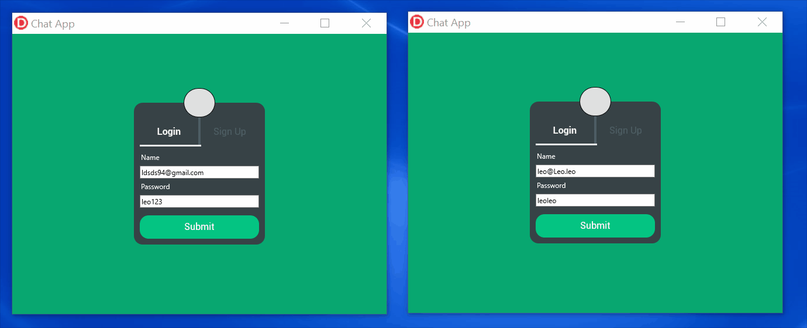

# ChatApp

<!-- Alterar cover quando o projeto estiver 100% funcional -->

> Software de conversas. Mensagens por texto.

O ChatApp é um software de conversas por mensagem criado usando Delphi. Ele usa de princípios de separação de conceitos e componentização para facilitar a escalabilidade e manutenibilidade. Seu design pode ser encontrado [aqui](https://www.figma.com/file/p2L7kPD7TsWBkr0tU8t1A2/Chat-App?node-id=0%3A1)

## 💻 Tecnologias

Foram usadas quatro tecnologias:

- [RAD Studio](https://www.embarcadero.com/br/products/rad-studio): uma IDE que tem por objetivo ser um ambiente rápido de desenvolvimento de apps
- [Firemonkey](https://www.embarcadero.com/br/products/rad-studio/fm-application-platform): um framework de criação de telas multiplataforma.
- [FB4D](https://github.com/SchneiderInfosystems/FB4D/): biblioteca que facilita a integração com o Firebase.
- [Firebase](https://firebase.google.com/): uma plataforma digital da Google utilizada para facilitar o desenvolvimento de aplicativos através de serviços como de autenticação e banco de dados em tempo real.

## 🚀 Instalando o ChatApp

Para instalar o ChatApp, basta entrar na aba de [Releases](https://github.com/LeoUpperThrower4/ChatApp/releases) do Github, baixar a versão desejada e executar o arquivo .exe

## ☕ Usando o ChatApp

A usabilidade é simples. Na tela inicial, é possível fazer login ou criar uma conta.
Depois de autenticado, é possível enviar mensagens no chat global.

## 📫 Contribuindo para ChatApp

> Sua contribuição é muito bem vinda! 😀

Para contribuir com o ChatApp, siga estas etapas:

1. Bifurque este repositório.
2. Crie um branch: `git checkout -b <nome_branch>`.
3. Faça suas alterações e confirme-as: `git commit -m '<mensagem_commit>'`
4. Envie para o branch original: `git push origin ChatApp / <local>`
5. Crie a solicitação de pull.

Como alternativa, consulte a documentação do GitHub em [como criar uma solicitação pull](https://help.github.com/en/github/collaborating-with-issues-and-pull-requests/creating-a-pull-request).

## 📝 Licença

Esse projeto está sob licença MIT.
